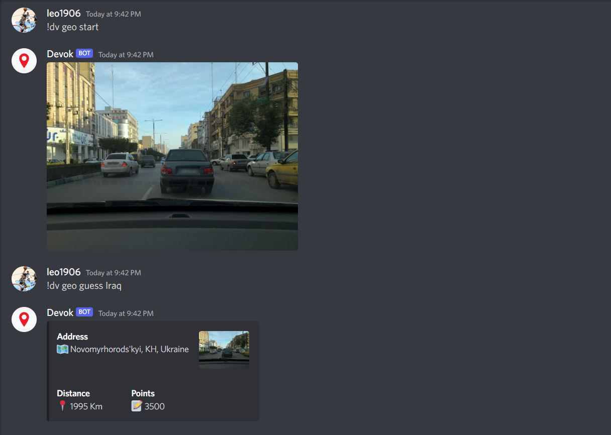

# [Discord Gaming Bot 🎮️](https://github.com/DevokSoftware/discord-gaming) 


[](https://github.com/DevokSoftware/discord-gaming/issues?q=is%3Aopen+is%3Aissue)

---
## Introduction 
Discord Bot with multiple games. 

---
### GeoGuessr

Users can try to guess the location of a given picture, using cars, buildings, roads, weather or other characteristics as hints.

Write the following command to start a game and receive a location picture:

```bash
!dv geo start
```

With this command users can make a guess:
```bash
!dv geo guess [location]
```



---


<p>📄 Other games will be developed.</p>
<p>📄 Character points, experience and other stats also will be added in the future.</p>

### 💬 [Join my discord server if you wanna help!](https://discord.gg/f7gs7xddX) 
